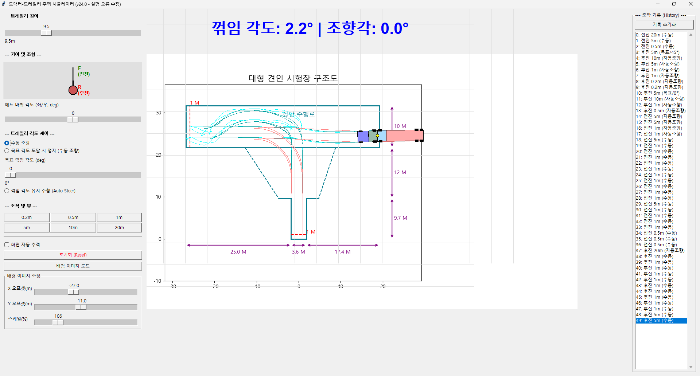

# 대형견인(트레일러) 면허시험 시뮬레이터

이 프로젝트는 대형견인(트레일러) 면허시험의 '방향 전환 코스(T자 코스)'를 연습할 수 있는 간단한 2D 시뮬레이터입니다.

사용자는 트랙터-트레일러 차량을 조작하여 후진으로 코스를 통과하는 연습을 할 수 있으며, 다양한 제어 기능을 통해 여러 시나리오를 시뮬레이션할 수 있습니다.

유료트럭이 실시간 조작하여 차를 몸으로 콘트롤하는 연습을 하기 좋다면, 
이 시뮬레이터는 이동할 방향을 머리로 먼저 세팅하고, 그것을 실현하는 방식이어서 머리로 연습하기 좋습니다. 

## 주요 기능

*   **물리 시뮬레이션**: 트랙터(견인차)의 조향각과 트레일러의 꺾임각(굴절각)을 반영한 2D 물리 엔진을 통해 실제와 유사한 차량 움직임을 제공합니다.
*   **직관적인 컨트롤 패널**: 마우스와 키보드를 사용하여 기어 변경, 조향, 트레일러 목표 각도 설정 등 다양한 조작을 쉽게 할 수 있습니다.
*   **조작 기록 (History)**: 사용자의 모든 주행 조작이 기록되어, 원하는 시점으로 쉽게 돌아가 반복 연습이 가능합니다.
*   **배경 이미지 지원**: `course_image_making.py`로 생성하거나 직접 만든 코스 이미지를 불러와 실제 시험장과 유사한 환경에서 연습할 수 있습니다.
*   **사용자 설정 저장**: 배경 이미지의 위치, 크기 등 사용자 설정이 `truck_sim_config.json` 파일에 자동으로 저장되어 다음에 실행할 때 복원됩니다.
*   **스크린샷**:    


## 파일 구성

*   `truck_sim_v1.py`: 메인 시뮬레이터 프로그램입니다.
*   `course_image_making.py`: Matplotlib을 사용하여 시뮬레이터의 배경으로 사용할 수 있는 시험장 코스 이미지를 생성하는 스크립트입니다. 필요하다면 스크립트를 수정하여 코스를 원하는대로 수정할 수 있습니다. 생성된 이미지를 저장하여 시뮬레이터에서 불러올 수 있습니다.

## 요구 사항

이 프로그램을 실행하기 위해 다음 Python 라이브러리가 필요합니다.

*   **Tkinter**: Python 표준 라이브러리로, 별도 설치가 필요 없습니다.
*   **Pillow**: 배경 이미지 처리 및 로드를 위해 필요합니다.
    ```shell
    pip install Pillow
    ```
*   **Matplotlib**: `course_image_making.py`를 실행하여 코스 이미지를 생성할 때 필요합니다.
    ```shell
    pip install matplotlib
    ```

## 실행 방법

### 1. 코스 이미지 생성 (선택 사항)

먼저 `course_image_making.py`를 실행하여 시험장 코스 이미지를 생성하고 원하는 이름(예: `course.png`)으로 저장합니다.

```shell
python course_image_making.py
```

### 2. 시뮬레이터 실행

`truck_sim_v1.py`를 실행하여 시뮬레이터를 시작합니다.

```shell
python truck_sim_v1.py
```

시뮬레이터가 실행된 후, "배경 이미지 로드" 버튼을 클릭하여 위에서 생성한 코스 이미지를 불러올 수 있습니다.

## 사용 방법

*   **트레일러 길이**: 슬라이더를 조절하여 트레일러의 길이를 8.5m에서 12.0m 사이로 변경할 수 있습니다.
    *   **기본 값**: 10m 로 되어 있는데, 9.5m 가 맞을 수도 있습니다.
*   **기어 및 조향**:
    *   **기어**: 'F'(전진)와 'R'(후진)이 표시된 회색 박스를 클릭하여 기어를 변경합니다.
    *   **헤드 바퀴 각도**: 슬라이더를 움직여 트랙터의 조향각을 조절합니다.
*   **트레일러 각도 제어**:
    *   **수동 조향**: '헤드 바퀴 각도' 슬라이더로 직접 조향합니다.
    *   **목표 각도 도달 시 정지**: 설정된 목표 꺾임 각도에 도달하면 주행이 자동으로 멈춥니다.
    *   **꺾임 각도 유지 주행**: 현재 트랙터와 트레일러의 꺾임각을 유지하며 자동으로 조향합니다.
*   **조작 및 뷰**:
    *   **주행 버튼 (0.2m ~ 20m)**: 해당 거리만큼 현재 기어 방향으로 주행합니다.
    *   **화면 자동 추적**: 체크 시 트랙터가 항상 화면 중앙에 오도록 뷰가 자동으로 이동합니다. 체크 해제 시 마우스 왼쪽 버튼으로 뷰를 직접 옮길 수 있습니다.
*   **조작 기록 (History)**:
    *   모든 주행 기록이 오른쪽에 표시됩니다.
    *   목록에서 특정 항목을 클릭하면 해당 조작 직후의 상태로 시뮬레이션이 복원됩니다.
    *   "기록 초기화" 버튼으로 모든 기록을 삭제하고 초기 상태로 돌아갈 수 있습니다.
*   **배경 이미지 조정**:
    *   "배경 이미지 로드" 버튼으로 이미지를 불러온 후, X/Y 오프셋과 스케일 슬라이더를 이용해 코스와 차량의 위치를 맞출 수 있습니다.
    *   python course_image_making.py 으로 만들어진 이미지의 X/Y offset은 -27, -11, 스케일(배율)은 105 가 적당해 보입니다. 
    *   한번 설정하면 저장되고 다음에 그대로 세팅됩니다.
*   **사용 예시 동영상 **:
    *   https://blog.naver.com/creeras/224090148099
